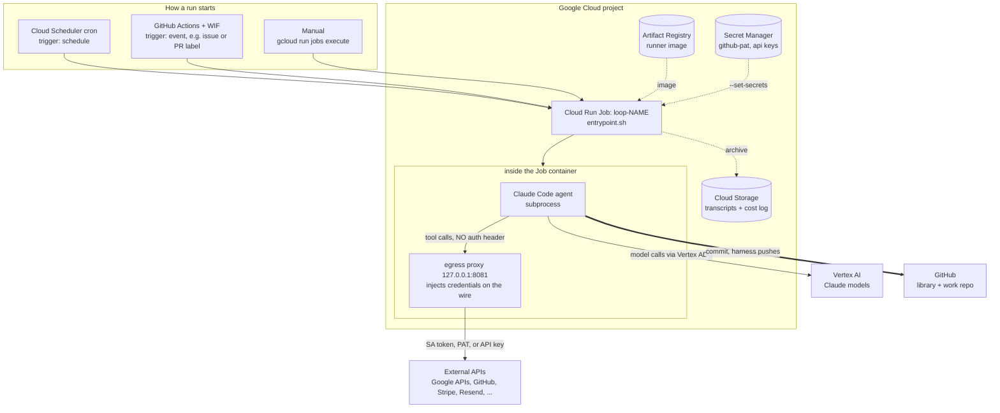

# loop-runner

**A task-agnostic harness that runs any agentic loop headless in a Cloud Run Job.**

Point it at a folder, and it runs that loop end to end: clone the repo, run the agent (Claude Code on
Vertex), then **guarantee** commit → push → verify → record before it exits. Because the harness runs
the agent as a *subprocess* and shares its filesystem, the notorious loop failure modes —
deploy-without-commit, Groundhog Day, "how do I even invoke the verifier" — stop being your problem.
You own the container, so the container enforces them.

> Loop Engineering in one line: **TRIGGER → EXECUTE → VERIFY → RECORD → STOP.** The agent forgets;
> the repo doesn't. The repo is the loop's memory.

## Why

Any repeatable agent workflow with clear checks and a stopping condition can run as a loop: a
support-ticket triager, a Slack-digest-to-issues bot, an error sweep, a nightly refactor, an
autonomous engineer that drains a backlog. Adding a new *kind* of loop never means touching the
runner — you just add a `loops/<name>/` folder.

## How it works (30 seconds)

- One task-agnostic image. `LOOP=<name>` picks the spec.
- Everything that differs between loops — model, turn cap, prompt, verifier, skills, identity, push
  mode — is read from `loops/<name>/loop.yaml` **at runtime from the fresh clone**, so editing a loop
  needs no rebuild.
- **Hooks you own**: a Stop hook commits + pushes whatever the agent leaves behind (the persistence
  guarantee); a PreToolUse guard blocks irreversible footguns (`rm -rf /`, force-push, `reset --hard`,
  and any project you declare off-limits via `GUARD_BLOCKED_PROJECTS`).
- **`push:` per loop**: `main` (the loop ships), `pr` (the loop proposes; can never land on main),
  or `none`.
- **Connectors**: any HTTPS API becomes a data aperture via an egress proxy that injects the
  credential outside the sandbox — the agent calls the API with no auth header and never sees the
  key. See [docs/proxy.md](docs/proxy.md).
- **Headless browser** (opt-in): a loop that must drive a real UI — click, fill, submit, read what
  rendered — gets headless Chromium + the chrome-devtools MCP tools just by naming them in its tools.
  See [docs/browser.md](docs/browser.md).

## Architecture on GCP

Each loop is one **Cloud Run Job**. Something triggers an execution (a Cloud Scheduler cron for
`trigger: schedule`, a GitHub Action via Workload Identity Federation for `trigger: event`, or a
manual `gcloud run jobs execute`). The Job pulls the runner image from Artifact Registry and its
secrets from Secret Manager, then runs `entrypoint.sh`: clone → start the local egress proxy → run
the agent → guarantee commit/push/verify → archive the transcript.



- **Trigger → Job**: scheduled, event-driven, or manual — all land on the same `gcloud run jobs
  execute`. The image is task-agnostic; `LOOP=<name>` selects the spec.
- **Model auth** goes straight to Vertex AI via the Job's service account (ADC), *not* through the
  proxy.
- **Everything else** (Google APIs, GitHub, third-party APIs) goes through the local proxy, which
  injects the credential so the agent never holds it. Details: [docs/proxy.md](docs/proxy.md).
- **Outputs**: the agent's work is committed and pushed to GitHub (the harness guarantees it); the
  transcript and a cost record are archived to Cloud Storage. Details: [docs/sessions.md](docs/sessions.md).

## Quickstart

**Skill-first.** Teach your own Claude Code the whole runbook (setup, canary, authoring, deploy,
debug), then let it drive:

```bash
npx skills add SaschaHeyer/loop-runner   # installs the /loop-runner skill (Agent Skills standard)
# then, inside Claude Code:  "set up loop runner and deploy the canary"
```

Or by hand:

```bash
# 1. configure (project, region, service account, secrets)
cp loop-runner/.env.example loop-runner/.env && edit loop-runner/.env

# 2. deploy the canary loop and run it
cd loop-runner
LOOP=hello-world REPO_FULL_NAME=<you>/loop-runner ./deploy.sh
gcloud run jobs execute loop-hello-world --region=us-central1 --project=<your-project> --wait
```

A healthy run logs `proxy live, CA trusted`, then `work_done=… pushed=true`, and lands a commit on
`origin/main`. Full walkthrough: [loop-runner/get-started.md](loop-runner/get-started.md).

## Add a loop

```bash
./new-loop.sh my-loop      # scaffold loops/my-loop/ from loops/_template
```

Fill in `loops/my-loop/`:

| File | Purpose |
|------|---------|
| `loop.yaml` | model, turns, prompt, verifier, push mode, connectors, identity |
| `prompt.md` | the brief the agent runs |
| `verify.sh` | the check (exit 0 = pass) — this is your stopping condition, be honest about it |
| `agents/*.md` | optional sub-agents (e.g. an independent verifier) |

## Layout

```
loop-runner/     the engine — entrypoint, deploy, spec parser, proxy, hooks, connectors
loops/
  _template/     scaffold for a new loop
  hello-world/   a runnable canary loop
  auto-fix/      bug-fix loop — failing test → root-cause fix → PR (Two-Repo Mode)
  issue-fix/     the GitHub issue-fixer — label an issue `agent-ready`, wake up to a PR
skills/
  loop-new/      interview-driven authoring skill for new loops
.claude/skills/
  loop-runner/   the installable operator skill — npx skills add SaschaHeyer/loop-runner
site/            the landing page (claymation, Tailwind) — see site/README.md
```

## Honest boundaries

- Runs on **Google Cloud** (Cloud Run Jobs + Cloud Scheduler) with **Claude on Vertex AI**. That's
  the supported runtime today; it isn't cloud-agnostic yet.
- A fresh GCP project needs the Claude models enabled in Vertex Model Garden once (accept the EULA).
- Verifier tiers are declared honestly per loop. A check that reads back ground truth (tests pass, a
  PR exists, a file changed) is stronger than a model grading its own work — say which one you have.

## License

Apache-2.0. See [LICENSE](LICENSE).
