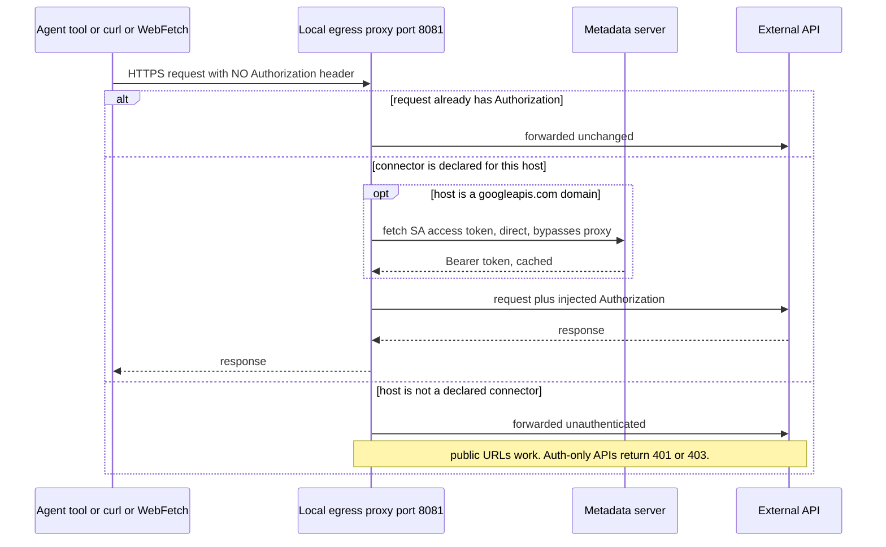

# The egress proxy — how loops reach APIs without ever holding a secret

A loop is only as useful as the data it can reach. But an autonomous agent that holds raw API keys
is a liability: a key in the prompt, the context window, a log line, or a committed file is a key
leaked. The loop runner solves this with a **local egress proxy** that injects credentials **on the
wire** — the agent calls an API with *no* auth header, and the proxy adds the right one as the
request leaves the container. The secret is set on the Job from Secret Manager and lives only in the
proxy process's environment; it never enters the agent's context, prompt, or filesystem.

Implementation: [`loop-runner/proxy_addon.py`](../loop-runner/proxy_addon.py) (a
[mitmproxy](https://mitmproxy.org/) addon), started by
[`loop-runner/entrypoint.sh`](../loop-runner/entrypoint.sh).

## The one rule

> **Inject a credential only when the request has no `Authorization` header.**

This single rule is what makes it safe:

- The **agent CLI's own model auth** (Claude Code on Vertex, or an Anthropic/Gemini API key) already
  sets its own `Authorization` header — the proxy sees it and leaves it untouched. No double-auth.
- A **tool** (or `curl`, or `WebFetch`) that sends *no* auth header gets the right credential filled
  in for its destination.

## How it starts (inside the Job)

`entrypoint.sh` brings the proxy up before running the agent:

1. **Clone first, proxy second.** The git clone happens *before* the proxy is configured, so the
   critical bootstrap runs over direct TLS and never depends on the intercepting CA.
2. **Start mitmproxy** bound to loopback only:
   ```
   mitmdump -s /harness/proxy_addon.py --listen-host 127.0.0.1 -p 8081
   ```
3. **Trust its CA.** mitmproxy generates a CA cert on first run; the entrypoint copies it into the
   system trust store (`update-ca-certificates`) and exports the CA-bundle env vars every runtime
   respects: `REQUESTS_CA_BUNDLE`, `SSL_CERT_FILE`, `CURL_CA_BUNDLE`, `GIT_SSL_CAINFO`,
   `NODE_EXTRA_CA_CERTS`, `CLOUDSDK_CORE_CUSTOM_CA_CERTS_FILE`. Without trusting the CA, TLS
   interception would fail with cert errors.
4. **Route egress through it** by exporting `HTTP_PROXY` / `HTTPS_PROXY` (and lowercase variants) to
   `http://127.0.0.1:8081`.
5. **Self-test.** A no-auth request to a Google API (`PROXY_SELFTEST_URL`, a Firestore read by
   default) must return **HTTP 200** — proving injection works end to end. A non-200 means the
   injection or CA trust is broken, and it's logged loudly.
6. On exit, the proxy is killed and `HTTP(S)_PROXY` is unset so transcript uploads go direct via the
   Job's native ADC.

## What gets injected for which host

**Two connectors are built in**, because the harness itself depends on them — not because of any
particular use case:

| Destination | Credential | Source |
|---|---|---|
| `*.googleapis.com` | `Bearer <access token>` + `X-Goog-User-Project` | the **Job's service account**, fetched from the GCE/Cloud Run **metadata server**, cached and auto-refreshed |
| `github.com`, `*.github.com` | `Basic base64` of `x-access-token:<GITHUB_PAT>` | `GITHUB_PAT` from Secret Manager; always injected — the harness needs it to clone and push |

These two are special-cased in code because their auth *shape* is special (a metadata-server token; a
Basic-auth git PAT). The metadata fetch uses a direct opener that bypasses the proxy, so it can never
self-loop.

**Every other connector is data, not code.** You declare it in
[`connectors/registry.json`](../loop-runner/connectors/registry.json) as
`connector → { domain, secret, env, header }`, and *both* the proxy (injection) and `deploy.sh`
(`--set-secrets` wiring) read it — no code change in either. The registry ships with a few
**examples** just to show the shape; keep, remove, or replace them for whatever APIs *your* loops
call:

| Example entry | Domain | Injects |
|---|---|---|
| `resend` | `api.resend.com` | `Bearer <RESEND_API_KEY>` |
| `stripe` | `api.stripe.com` | `Bearer <STRIPE_SECRET_KEY>` |
| `cloudflare` | `api.cloudflare.com` | `Bearer <CLOUDFLARE_API_TOKEN>` |
| `slack` | `slack.com` | `Bearer <SLACK_BOT_TOKEN>` |

None of these activate unless a loop *declares* the connector and the matching secret exists — so
shipping the examples costs nothing. To wire your own API, see "Adding a connector" below.

## Least privilege — connector scoping

Injection is scoped to what each loop *declares*. `loop.yaml` lists `connectors: [github, gcp]`; the
entrypoint exports `LOOP_CONNECTORS` plus `LOOP_CONNECTORS_ENFORCE=1`, and the proxy then injects
**only** for those connectors.

- `connectors: [github]` → the loop can auth to GitHub and nothing else.
- `connectors: []` → the loop physically **cannot** reach any authenticated API; its self-test
  returns 401/403 instead of 200, by design.

A credential the loop didn't ask for is never applied, even though the secret may be present in the
environment.

## Important: it injects, it does not block

The proxy is an **injection** layer, not a blocking allowlist. A request to a domain with no
configured connector still goes out — just **unauthenticated**. So:

- `WebFetch` / `curl` of any **public** URL works normally in-container.
- Hitting an authenticated API you didn't declare simply fails with the API's own 401/403.

If you need a hard network boundary (deny-by-default egress), enforce it at the VPC / firewall layer;
the proxy's job is credential injection, not perimeter control.

## Adding a connector

1. Put the secret in **Secret Manager**.
2. Wire `--set-secrets` in [`loop-runner/deploy.sh`](../loop-runner/deploy.sh) so it lands in the
   Job's env.
3. Add one entry to `connectors/registry.json`:
   ```json
   "slack": { "domain": "slack.com", "env": "SLACK_BOT_TOKEN", "header": "Bearer {}" }
   ```
4. Declare it in the loop: `connectors: [slack]`.

No proxy code changes. Recipes and worked examples: [`loop-runner/connectors/`](../loop-runner/connectors/).

## Local testing

Outside GCP there is no metadata server, so the SA-token path falls back to a `GCP_ACCESS_TOKEN` env
var if you set one. Third-party and GitHub injection work the same as long as the env vars are
present.

## Request flow


