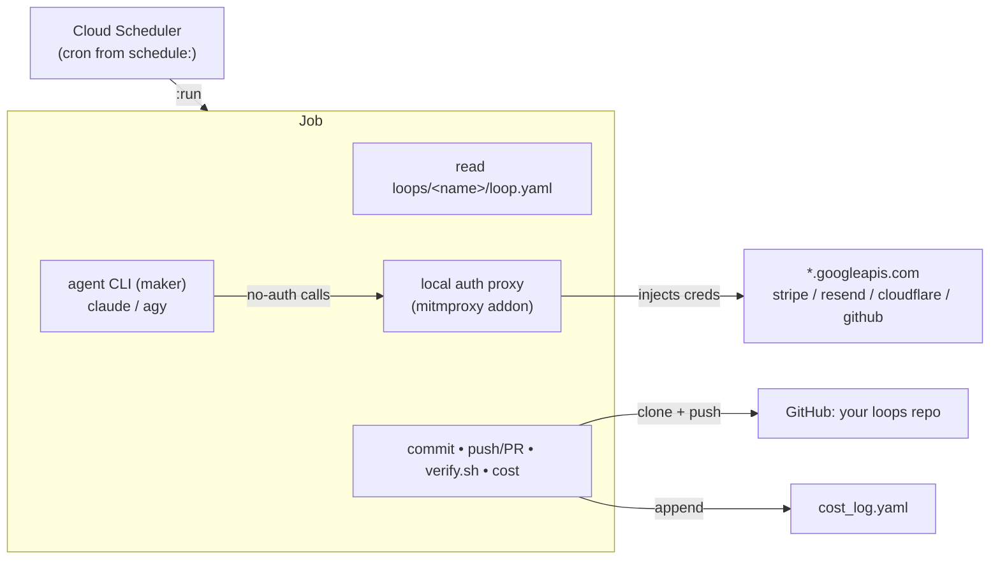

# loop-runner — the in-process loop harness

The invariant machinery that runs **any** loop in this library headless in a Cloud Run Job, on a Cloud
Scheduler cron. Pick the loop with `LOOP=<name>`; the runner reads `loops/<name>/loop.yaml` for
everything that differs.

The agent CLI is a *subprocess* of `entrypoint.sh`, so the harness shares its filesystem and can
**guarantee** commit/push/verify after it exits. This is the fix for the Loop Engineering failure modes:
deploy-without-commit, Groundhog Day, and "how do I invoke the verifier" all dissolve when the harness
is in-process, because you own the container. Every loop appends to the same
`cost_log.yaml`, so all runs show up in one cost log.

## What's invariant vs per-loop

The runner (this dir) never changes: the trigger→execute→verify→commit→record→stop spine, the auth
proxy, the base hooks, cost logging, and the transcript archive. Each loop supplies only the spec:

```
loops/<name>/loop.yaml     model · turns · budget · prompt · verifier · skills · push mode · tier
             prompt.md      the per-loop kickoff
             system.md      optional per-loop system prompt
             verify.sh      the loop's own verifier (exit 0 = pass)
             hooks/          optional per-loop hooks (merged over the base hooks)
             skills/         optional per-loop skills
```

## Flow



`entrypoint.sh`: clone the repo → read the spec → assemble hooks + skills → start the local auth proxy
→ run the agent CLI (the maker) → **agent exits** → commit anything left behind (the persistence
guarantee) → push to `main` or a PR branch (per the spec's `push:`) → run the loop's `verify.sh` → log
cost in the shared schema → archive the transcript to GCS → exit.

## Two-repo mode — library vs work repo (M8)

By default the cloned repo is both the *spec source* and the *work dir* — the agent edits and commits
the same repo the spec lives in (single-repo mode). Set `repo:` in a loop's `loop.yaml` to split them:

```yaml
repo: your-org/your-work-repo   # optional; the agent operates + commits HERE
```

The **harness** clones both (never the agent): the library repo (this one — spec, prompt, verifier,
shared skills; read-only during the run) and the work repo (the agent's cwd; the thing committed +
pushed). Every spec artifact resolves against the library; all work happens in the work repo. Hooks
and skills are injected into the work repo's `.claude/`, the persist Stop hook and `verify.sh` both
operate on it, and a work-repo loop **never** pushes to the library. This is the prerequisite for
running multiple loops/CEOs that each own their own repo. `test/test_m8_work_repo.sh` proves the split
end to end against scratch `file://` remotes (free, no agent/API — set `GIT_HOST_BASE` to point clones
at a local host).

## Hooks — because you own the container

A prompt can *request* a boundary; a hook *enforces* it. That is the point of running the sandbox
yourself. Hooks come in **two layers**, and the entrypoint merges them at runtime with
`merge_settings.py` into `<work-repo>/.claude/settings.local.json` (they fire in headless `--print`
mode). The merge **concatenates hook arrays per event**, so a loop's hooks are *added to* the base
hooks, never instead of them; every other key is overridden last-file-wins.

### 1. Base hooks — every loop, fleet-wide (`loop-runner/hooks/`)

Defined in `hooks/base-settings.json`; scripts baked into the image at `/harness/hooks/`. Change these
only to affect **every** loop.

- **`hooks/persist.sh`** (Stop) — the persistence guarantee, *in-process*: on stop, commit + push
  whatever the agent left. The shell entrypoint does it too as a backstop.
- **`hooks/guard.sh`** (PreToolUse/Bash) — enforces the hard boundaries the prompt only *asks* for:
  blocks any command touching the off-limits project, force-push, `git reset --hard`, `rm -rf /`, and
  (under a `PUSH_OVERRIDE` dry run) any `git push`.

### 2. Per-loop hooks — one loop only (`loops/<name>/hooks/`)

Optional. Add `loops/<name>/hooks/settings.json` — a Claude Code settings JSON with a `hooks` block —
and it is merged **on top of** the base hooks for that loop. Put any hook script beside it in
`loops/<name>/hooks/`. One caveat on the script path: the agent's cwd is the *work* repo, but your
script lives in the *library* clone, so reference it by its fixed runtime path
`/workspace/repo/loops/<name>/hooks/<script>.sh` (that is where the library always lands in the Job),
or keep the hook command self-contained inline.

```jsonc
// loops/<name>/hooks/settings.json — adds a PreToolUse/Bash hook on top of the base persist+guard
{
  "hooks": {
    "PreToolUse": [
      { "matcher": "Bash",
        "hooks": [ { "type": "command", "command": "bash /workspace/repo/loops/<name>/hooks/my-hook.sh" } ] }
    ]
  }
}
```

Hook script contract (same as the base guard): **exit 2** blocks the tool call and feeds the stderr
reason back to the model; **exit 0** allows it. Worked example: [`loops/hook-demo/`](../loops/hook-demo/)
ships a per-loop `no-egress.sh` PreToolUse hook that blocks network commands for an offline loop; its
verifier asserts all three hooks (base persist + base guard + the loop's own) end up in the merged
settings. This per-loop layer is also how **M4** (a `PostToolUse` budget-stop hook) will attach.

## Keep the loop's tools unchanged: the auth proxy

The CEO's tools (see `workspace/tools/PORTING.md`) are **proxy-only**: they call `*.googleapis.com`,
`api.stripe.com`, `api.resend.com`, `api.cloudflare.com` with **no auth header** and rely on an egress
proxy to inject credentials. The managed runtime provides that proxy; this Job runs the **same
injection locally** via a small mitmproxy addon (`proxy_addon.py`) that mirrors
`run_loop.py:PROXY_API_KEYS`. Result: a loop's business code runs verbatim, no rewrites. A deterministic
self-test (a no-auth Firestore call that must return 200) proves the injection each run.

**Adding a connector** (any HTTPS API — Slack, Jira, …) is three steps: a Secret Manager secret, a
`--set-secrets` line in `deploy.sh`, and one line in the addon's `_API` map. Recipes, the paste-ready
Slack app manifest, and the bot-vs-user-token decision live in [`connectors/`](connectors/README.md).

**Connectors are scoped, not global (M5).** A loop only gets what its `connectors:` list declares:
`deploy.sh` injects only those secrets, and the proxy injects auth only for those domains (the
entrypoint hands it `LOOP_CONNECTORS`). So a `connectors: []` loop reaches no authenticated API — its
proxy self-test returns 401/403, not 200 (the Firestore self-test only passes for loops declaring
`gcp`). Least privilege per loop; declare exactly what the loop uses.

## Deploy

```bash
cd loop-runner
LOOP=ceo ./deploy.sh                 # build the image + deploy Job loop-ceo + cron from its schedule:
LOOP=error-sweep BUILD=0 ./deploy.sh # reuse the built image, deploy Job loop-error-sweep
gcloud run jobs execute loop-ceo --region=us-central1 --project=your-gcp-project --wait
```

Reuses the existing Secret Manager secrets (`github-pat`, `resend-api-key`, `stripe-secret-key`,
`cloudflare-api-token`). The runner SA needs `roles/aiplatform.user` (deploy.sh grants it) and, if not
already present, `roles/datastore.user` + `roles/secretmanager.secretAccessor`. `SMOKE=1` runs a
constrained harness validation with no loop actions; `CREATE_CRON=0` deploys the Job without a cron.

## Local dev mode — dry run (no push)

By default the harness **always pushes** — that's the persistence guarantee, and it applies even to
`SMOKE=1`. For local iteration, set `PUSH_OVERRIDE=none` to force the `none` push path regardless of
what the loop's own `push:` says: the harness still clones, runs the agent, and commits locally, but
never pushes, prints a loud `DRY RUN — nothing pushed` line plus the would-be diffstat, and
`PERSIST_PUSH=0` so the Stop hook doesn't push either. This is enforced, not just requested:
`guard.sh` (the same PreToolUse hook that blocks force-push/hard-reset) also blocks any `git push`
the agent tries directly via Bash while `PUSH_OVERRIDE` is set — the harness's own bookkeeping isn't
the only way work could reach `origin`.

```bash
docker build -t loop-runner loop-runner/
docker run --rm \
  -e LOOP=hello-world \
  -e REPO_FULL_NAME=SaschaHeyer/loop-runner \
  -e GITHUB_PAT="$(gcloud secrets versions access latest --secret=github-pat --project=your-gcp-project)" \
  -e GCP_ACCESS_TOKEN="$(gcloud auth print-access-token)" \
  -e GCP_PROJECT=your-gcp-project \
  -e PUSH_OVERRIDE=none \
  loop-runner
```

The proxy addon falls back to `GCP_ACCESS_TOKEN` when there's no metadata server (i.e. off Cloud Run).
A dry-run-aware verifier should treat `PUSHED=false` as expected rather than a failure when
`PUSH_OVERRIDE` is set — see `loops/hello-world/verify.sh` for the pattern (check `${PUSH_OVERRIDE:-}`
and skip the push assertion). Without `PUSH_OVERRIDE`, a local Docker run behaves exactly like the
Cloud Run Job — including pushing to `origin/main` — so point `REPO_FULL_NAME` at a throwaway fork if
you want a real push without `PUSH_OVERRIDE`.

## Switch the CLI

`AGENT_CLI=claude` (default, proven) or `AGENT_CLI=agy` (antigravity CLI). The entrypoint treats it as a
swappable subprocess.

### ⚠️ `agy` cannot run headless yet (verified 2026-06-29, agy 1.0.12)

The antigravity CLI has **no headless authentication path**. It requires a prior interactive OAuth login
cached on the machine. In a fresh container it drops to a browser OAuth flow a cron job cannot complete,
and a valid AI Studio API key does not help: `GEMINI_API_KEY`, `ANTIGRAVITY_API_KEY`, and
`GOOGLE_API_KEY` are all ignored. Tracking upstream:
<https://github.com/google-antigravity/antigravity-cli/issues/78> (open). **Until a headless token /
API-key path ships, use `AGENT_CLI=claude`.** The `agy` branch in `entrypoint.sh` already carries the
correct print-mode flags for the day this is fixed.

## What a healthy run looks like

A healthy run shows: `gcloud builds submit` succeeds; `execute` logs `proxy live, CA trusted` then
`work_done=… pushed=true`; a new commit lands on `origin/main`; and a `cloud-run-job` record appears
in the cost log. Check the proxy-injected tool call first — it's the riskiest piece.

## Costs (measured, CEO loop)

Real per-loop cost from Claude Code's `total_cost_usd` (billed amounts, not estimates):

| Run | Model | Turns | Cost | Wall |
|---|---|---|---|---|
| Smoke validation | Sonnet 4.6 | 6 | ~$0.23 | <1 min |
| Real loop (form redesign) | Sonnet 4.6 | 32 | $1.39 | ~9 min |
| Real loop (Airbnb-style calendar) | Opus 4.8 | 26 | $1.73 | ~4.4 min |

**Opus came out ≈ Sonnet (not 5x)** because each loop is ~98% cached context — the Opus loop read 1.48M
cached tokens (≈57K of context re-sent across 26 turns at ~0.1x). Caching, not the per-token rate,
dominates the bill. Cloud Run Job compute (per-second, scale-to-zero) and Cloud Build are negligible.

| Cadence | Opus 4.8 (~$1.73/loop) | Sonnet 4.6 (~$1.39/loop) |
|---|---|---|
| Daily | ~$52/mo | ~$42/mo |
| Hourly | ~$1,250/mo | ~$1,000/mo |

Prefer **daily / on-demand for a thinking loop** and push routine checks into cheap deployed code. A
cheap mechanical loop (like `error-sweep` on Sonnet with a low turn cap) costs far less per run.
**See a run's cost:** the `[harness] logged cost … est_cost=` line in Cloud Logging, or `total_cost_usd`
in `gs://<SESSIONS_BUCKET>/<loop>/<execution-id>/result.json`.

## Notes / limitations

- **You run the sandbox now.** The agent's bash runs in this container as the scoped runner SA — that SA
  is the blast radius, so keep it least-privilege (it already cannot touch other projects, and the guard
  hook blocks any command that names one).
- **TLS interception** by the local proxy requires every client to trust the mitmproxy CA; the entrypoint
  installs it system-wide and sets `NODE_EXTRA_CA_CERTS`/`REQUESTS_CA_BUNDLE`/etc. If a client still
  rejects it, that client's CA env var is missing.
- **Cost telemetry goes to Cloud Logging**, not git: `cost_log.yaml` is gitignored,
  so the harness logs the cost line rather than committing it.
